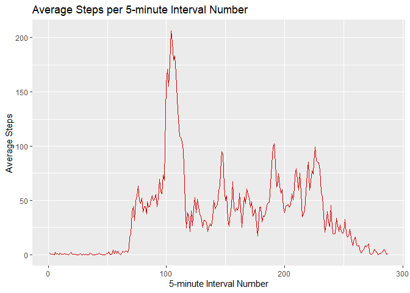

#### Loading and preprocessing the data

```r
library(dplyr, warn.conflicts=FALSE)
library(readr)
library(ggplot2)
library(lattice)

activity <- read_csv( "./data/activity.csv", col_types=cols(date=col_date("%Y-%m-%d"),
                                                            steps=col_number(),
                                                            interval=col_integer()))
```

#### Histogram of the total number of steps taken per day
The total number of steps taken per day is calculated and display in a histogram showing the frequency of daily steps.  

```r
steps_per_day <- activity %>% group_by(date) %>% 
                 summarise(sum = sum(steps, na.rm=TRUE), .groups="keep")

hist(steps_per_day$sum, breaks = nrow(steps_per_day), col="red4",
     main="Frequency of Steps Per Day", xlab="Steps Per Day")
```

<!-- -->

#### Mean number of steps taken per day
The mean value of steps taken for each day is calculated.

```r
spd_mean <- mean(steps_per_day$sum)
spd_mean 
```

```
## [1] 9354.23
```
#### Median number of steps taken each day

The median value of steps taken for each day is calculated.


```r
spd_median <- median(steps_per_day$sum)
spd_median
```

```
## [1] 10395
```
The mean steps per day is 9354.2295082 and the median steps per day is `sdp_median` when ignoring NA values for steps. 


#### Time series plot of the average number of steps taken
The mean steps per daily time interval is calculated. The column intervalNum is added to the mean_steps_per_interval data table for convenience in plotting the average steps for a particular daily interval.


```r
mean_steps_per_interval <- activity %>% group_by(interval) %>% 
                            summarise(avg_steps = mean(steps, na.rm=TRUE), 
                                      .groups="keep") 

mean_steps_per_interval$intervalNum <- 1:nrow(mean_steps_per_interval)

ggplot(data=mean_steps_per_interval, aes(x=intervalNum, y=avg_steps)) + 
  geom_line(color="red3") +
  labs(title="Average Steps per 5-minute Interval Number", 
       x="5-minute Interval Number",
       y="Average Steps")
```

<!-- -->

#### What is the 5-minute interval that, on average, that contains the maximum number of steps?


```r
max_avg <- max(mean_steps_per_interval$avg_steps)
max_avg_interval <- filter(mean_steps_per_interval, avg_steps == max_avg)

max_avg_interval
```

```
## # A tibble: 1 x 3
## # Groups:   interval [1]
##   interval avg_steps intervalNum
##      <int>     <dbl>       <int>
## 1      835      206.         104
```
The maximum average steps are 206.1698113 and is found in interval number 104 or the 835 interval of the day.


#### Code to describe and show a strategy of imputing missing data
There are number of missing values for steps in the original data. The process for imputing these missing values is to use the average value for the missing interval.


```r
nas <- is.na(activity$steps)
num_nas <- sum(nas)

num_non_nas <- nrow(activity) - num_nas

percent_na <- num_nas/nrow(activity)
```
The number of NAs values is 2304 and the number of non-NA values is 15264. The percentage of NA values is 0.1311475%. The percentage of NA values is too high to ignore so the process of for imputing the missing (NA) values will be to use the average steps value of the interval for the missing (NA) steps for that interval.


```r
imputed_activity <- activity

for( i in 1:nrow(imputed_activity) ) {
   if ( is.na(imputed_activity[i,]$steps)) {
     avs <- filter(mean_steps_per_interval, interval==imputed_activity[i,]$interval)
     imputed_activity[i,]$steps<- avs$avg_steps
   } 
} 
```

#### Histogram of the total number of steps taken each day after missing values are imputed


```r
imputed_steps_per_day <- imputed_activity %>% group_by(date) %>% 
                         summarise(sum = sum(steps), .groups="keep")


hist(imputed_steps_per_day$sum, breaks = nrow(imputed_steps_per_day), col="red4",
     main="Frequency of Steps Per Day (Imputed)", xlab="Steps Per Day")
```

<!-- -->

```r
imputed_mean <- mean(imputed_steps_per_day$sum)
imputed_mean
```

```
## [1] 10766.19
```

```r
imputed_median <- median(imputed_steps_per_day$sum)
imputed_median
```

```
## [1] 10766.19
```
The imputed mean steps per day is 10766 and the imputed median steps per day is 10766. The difference of imputed steps per day mean is 1412 and the difference in median of imputed steps per day is 371


#### Panel plot comparing the average number of steps taken per 5-minute interval across weekdays and weekends


```r
imputed_activity$day_type <- as.factor(ifelse(weekdays(imputed_activity$date) %in%                                                           c("Sunday","Saturday"),"weekend","weekday"))

steps_per_day_type <- imputed_activity %>% group_by(day_type, interval) %>% 
                      summarise(avg_steps = mean(steps), .groups="keep")

xyplot( avg_steps ~ interval | day_type, data=steps_per_day_type, type="l", layout=c(1,2),                   ylab="Average Number of Steps", xlab="5-minute Interval"  )
```

<!-- -->

